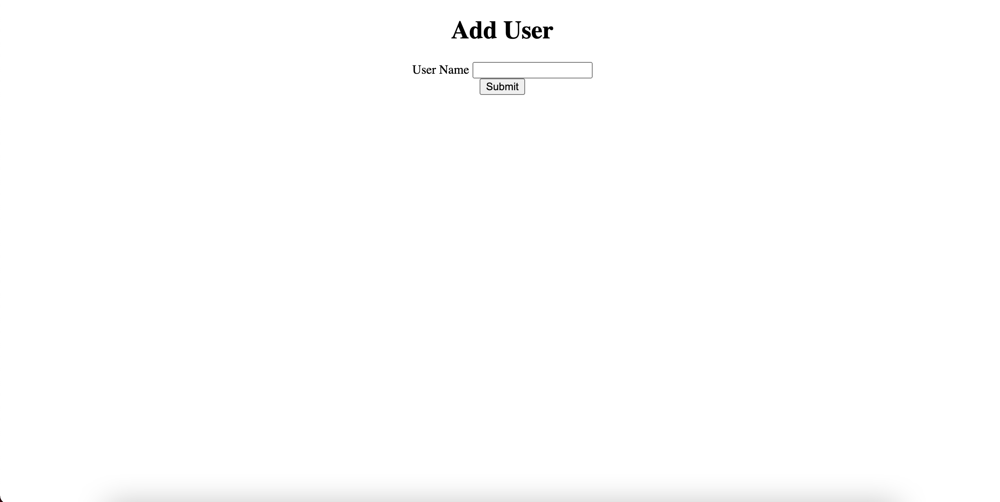
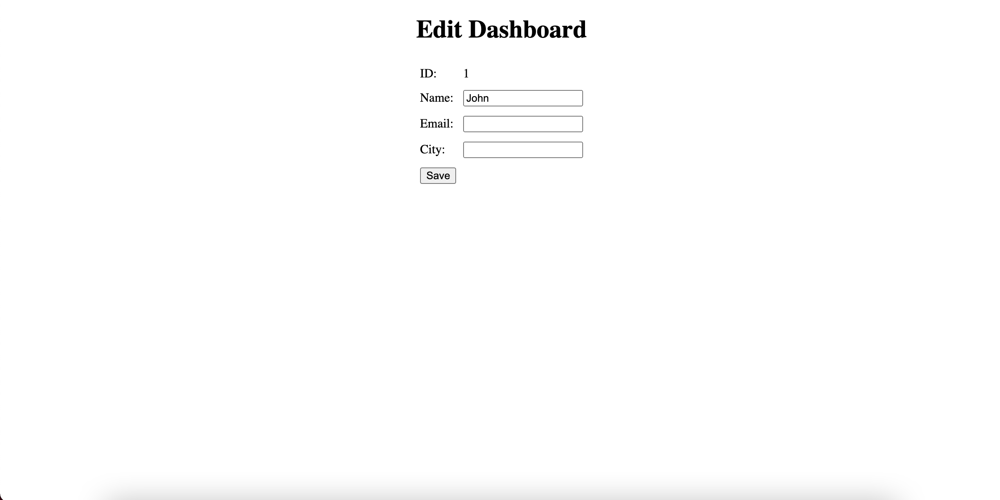
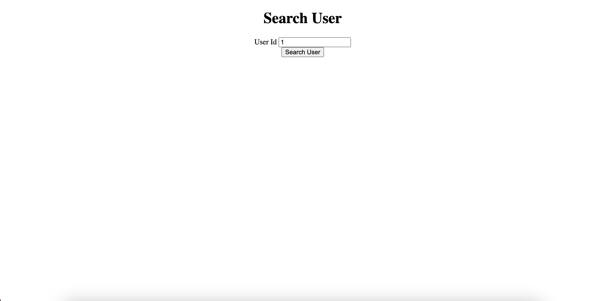
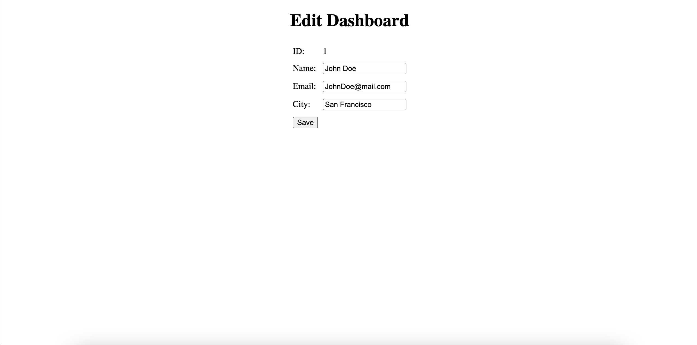
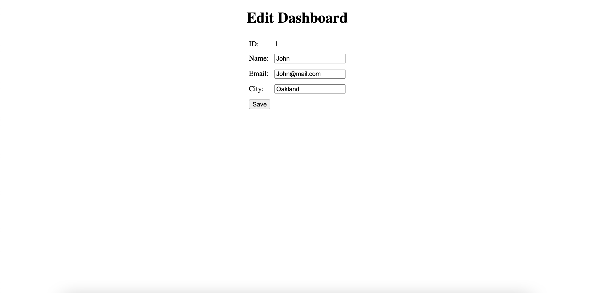
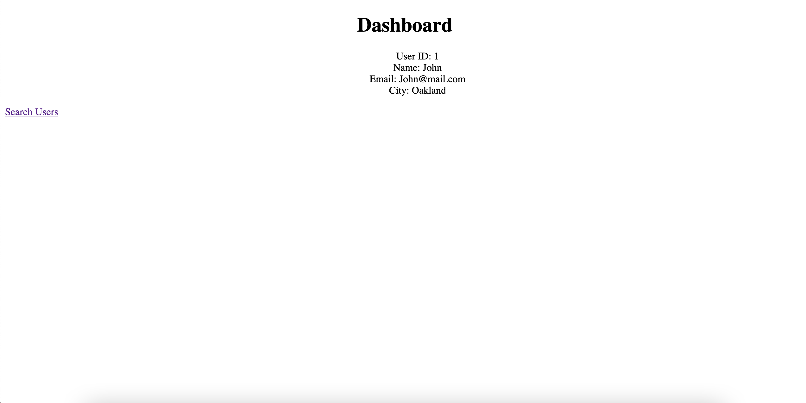
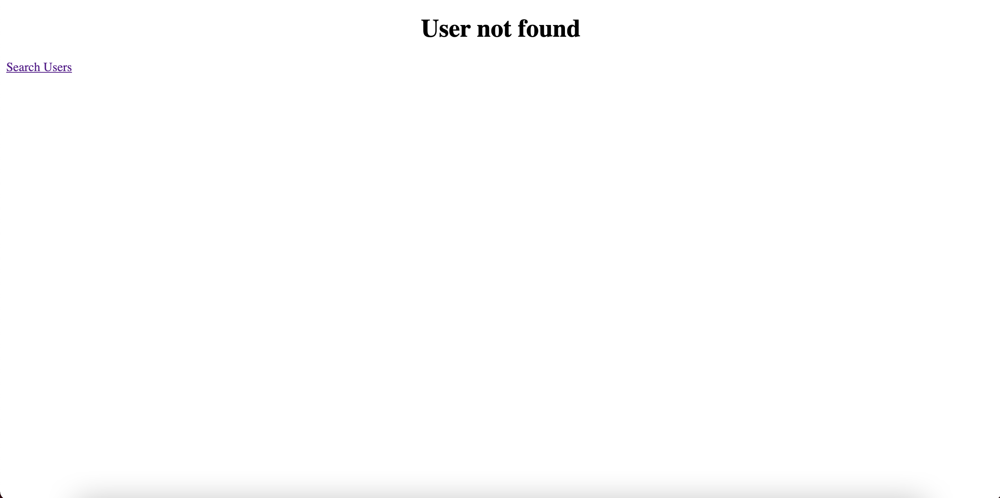

# Searching for a Specific User and Updating the User Information

This web application adds users or searchs for existing users by user ID and allows the user to modify the details of the specific user record...

## Features

	- Adds new users to database automatically assigning an unique user id
	- Searches existing users by user id 
	- Allows to user to modify and update user details after adding user or succesfully searching an existing user
	- Displays final user details

## Installation

	- Clone and pull source code from provided github repository
	- Run the SpringApplication 

## Code

	https://github.com/nicholas-auyeung/Phase3SearchUpdate

## Flow

1. Go to https://start.spring.io/

2. Enter the appropriate spring project settings:

	Project: Project
	Language: Java
	Spring Boot: 2.4.1
	Enter package names
	Packaging: Jar
	Java: 8

3. Enter the appropriate spring project dependencies:
	
	Spring Boot DevTools
	Lombok
	Spring Web
	MYSQL Driver
	Spring Data JPA

4. Import into Eclipse EE as maven project

5. Inside 'searchUpdate' maven project...src/main/java create controller, dao, entity, repository, and service packages.

6. Define src/main/resources/application.properties with appropriate url/uri pattern prefix/suffix and database settings/credentials.

7. Create entity User class inside 'entity' package.

8. Define User class with proper entity attributes and annotations from Sping JPA and Project Lombak.

9. Create user repository for user inside 'repository' package.

10. Define 'UserRepository' interface extending 'CrudRepository'.

11. Create dao interface for user inside 'dao' package.

12. Define 'UserDAO' interface with appropriate dao operations.

13. Create UserDAO implements class inside 'dao' package.

14. Define 'UserDAOImpl' class implementing the 'UserDAO' interface defining all abstract methods with dao operations.

15. Create service interface for user inside 'service' package.

16. Define 'UserService' interface with appropriate CRUD operation functions.

17. Create UserService implements class inside 'service' package.

18. Define 'UserServiceImpl' implementing the 'UserService' interface defining all abstract methods with functions from defined 'UserDAO' interface.

19. Create user model view controller inside 'controller' package.

20. Define 'UserController' class with appropriate model and view operations.

21. Create new folder directory inside src/main/

22. New folder path: /webapp/WEB-INF/views

23. Inside 'views' folder create corresponding appropriate jsp pages.

## Usage
Once run, navigate to localhost:8080/adduser on a web browser.
	
	The add user page will appear prompting the user for a user name.

	On clicking the 'submit' button user will be redirected to the edit dashboard page.

	
	On clicking the 'save' button user will be redirected to the dashboard page.
	The dashboard page will display user details.
	

	On clicking the 'Search Users' hyperlink user will be redirected to the search page.
	The search user page will appear prompting the user for a user ID;

Valid user ID

	On clicking the 'submit' button user will be redirected to the edit dashboard page displaying an edit form with current user details.

	
	

	On clicking the 'save' button user will be redirected to the dashboard page.
	The dashboard page will display user details.
	
Invalid user ID

	On clicking the 'submit' button user will be redirected to the user not found error page.
	The user not found error page displays the appropriate error message and 'Search Users' hyperlink to return to the search users page.
	

